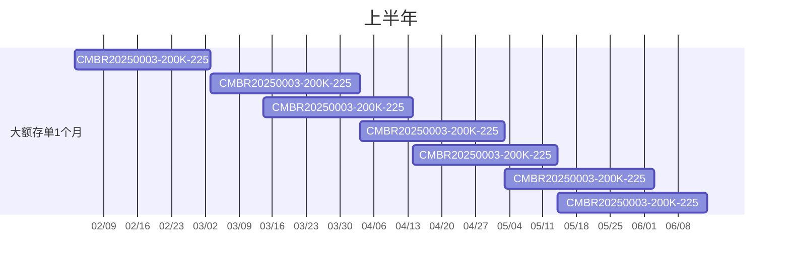
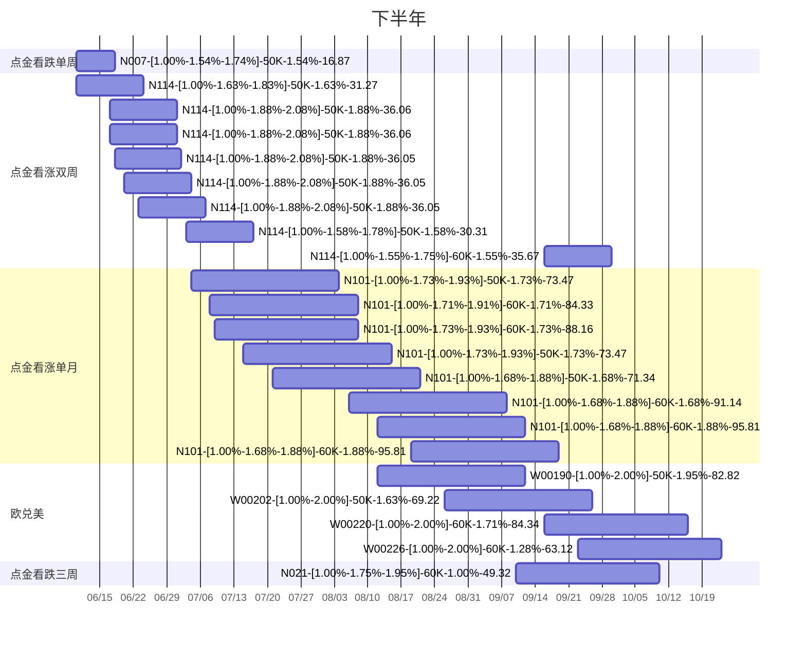

---
# 文章的标题
title: "2025年个人财报"
# 文章的时间
date: 2026-01-09T13:46:59+08:00
# 文章是否为草稿状态 草稿状态不会发布到文章列表
draft: false
# 文章描述 在文章列表页展示的内容
description: "文章描述"
# 文章的过期时间  过期后不会发布到文章列表
#expiryDate:  //.ExpiryDate
# 文章的发布时间  未到达发布时间不会发布到文章列表
#publishDate: //.PublishDate
# 上次修改的日期
#lastmod: // .Lastmod
# 作者
author: "OverLookArt"
---

