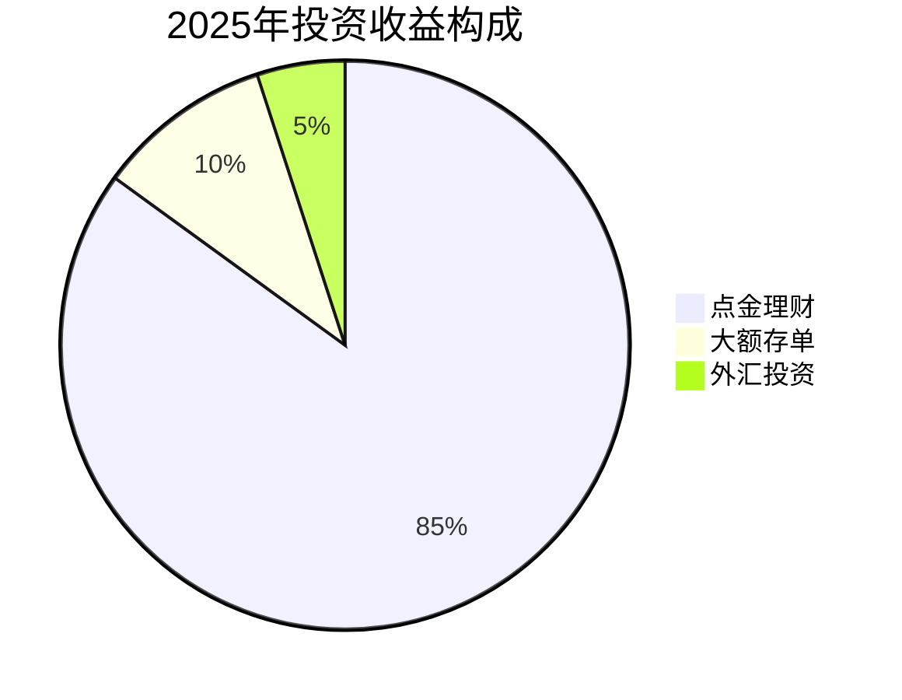
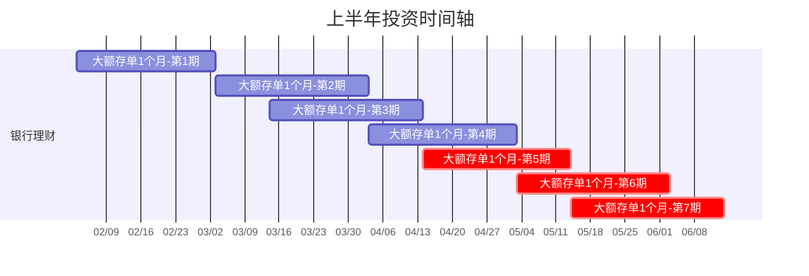
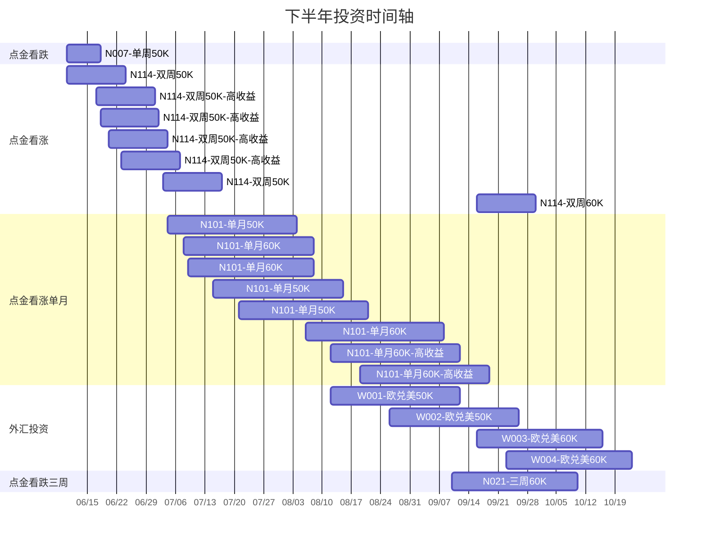
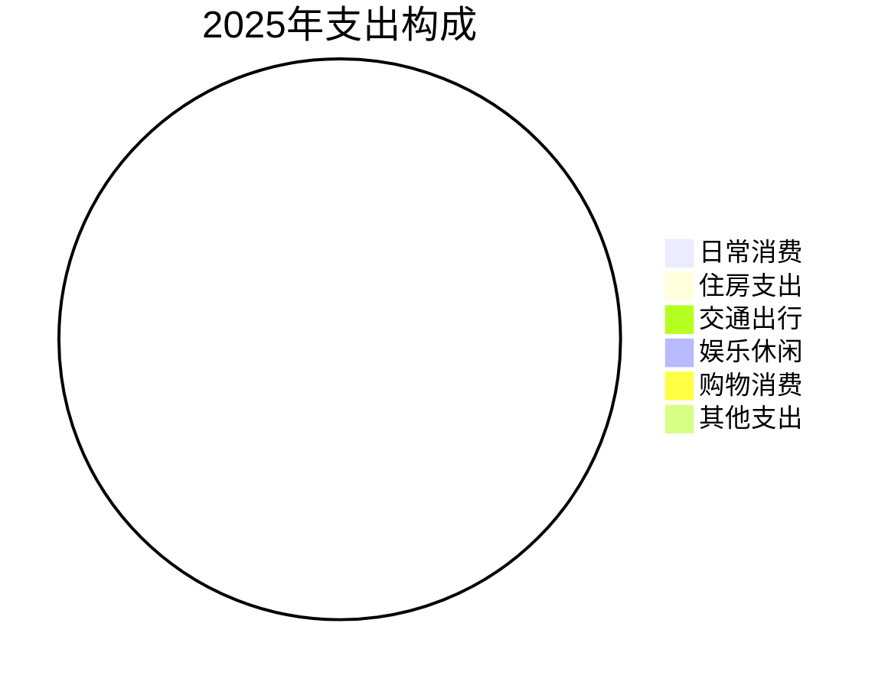

## 2025年度投资收益总览

### 年度收益统计

| 项目 | 金额（万元） |
|------|-------------|
| 银行理财 | 1.5+ |
| 结构性存款 | - |
| 外汇投资 | 约 0.3 |

### 收益分布

## 上半年投资明细

| 产品名称 | 投资金额 | 收益率 | 收益金额 | 投资周期 |
|----------|----------|--------|----------|----------|
| CMBR20250003-200K | 20万 | 基准收益 | - | 1个月 |
| CMBR20250003-200K | 20万 | 基准收益 | - | 1个月 |
| CMBR20250003-200K | 20万 | 基准收益 | - | 1个月 |
| CMBR20250003-200K | 20万 | 基准收益 | - | 1个月 |

## 下半年投资明细

### 点金理财系列

| 产品代码 | 类型 | 本金(万) | 收益率 | 收益(元) | 周期 |
|----------|------|----------|--------|----------|------|
| N007 | 看跌单周 | 50K | 1.54% | 16.87 | 1周 |
| N114 | 看涨双周 | 50K | 1.63% | 31.27 | 2周 |
| N114 | 看涨双周 | 50K | 1.88% | 36.06 | 2周 |
| N114 | 看涨双周 | 50K | 1.88% | 36.05 | 2周 |
| N114 | 看涨双周 | 50K | 1.88% | 36.05 | 2周 |
| N114 | 看涨双周 | 50K | 1.58% | 30.31 | 2周 |
| N114 | 看涨双周 | 60K | 1.55% | 35.67 | 2周 |
| N101 | 看涨单月 | 50K | 1.73% | 73.47 | 1月 |
| N101 | 看涨单月 | 60K | 1.71% | 84.33 | 1月 |
| N101 | 看涨单月 | 60K | 1.73% | 88.16 | 1月 |
| N101 | 看涨单月 | 50K | 1.73% | 73.47 | 1月 |
| N101 | 看涨单月 | 50K | 1.68% | 71.34 | 1月 |
| N101 | 看涨单月 | 60K | 1.68% | 91.14 | 1月 |
| N101 | 看涨单月 | 60K | 1.88% | 95.81 | 1月 |
| N101 | 看涨单月 | 60K | 1.88% | 95.81 | 1月 |
| N021 | 看跌三周 | 60K | 1.00% | 49.32 | 3周 |

### 外汇投资

| 产品代码 | 类型 | 本金(万) | 收益率 | 收益(元) | 周期 |
|----------|------|----------|--------|----------|------|
| W00190 | 欧兑美 | 50K | 1.95% | 82.82 | 1月 |
| W00202 | 欧兑美 | 50K | 1.63% | 69.22 | 1月 |
| W00220 | 欧兑美 | 60K | 1.71% | 84.34 | 1月 |
| W00226 | 欧兑美 | 60K | 1.28% | 63.12 | 1月 |

## 年度支出总览

### 支出统计

| 项目 | 金额（万元） |
|------|-------------|
| 日常消费 | - |
| 住房支出 | - |
| 交通出行 | - |
| 娱乐休闲 | - |
| 购物消费 | - |
| 其他支出 | - |

### 支出分布

## 支出明细记录

| 日期 | 类别 | 项目 | 金额（元） | 备注 |
|------|------|------|-----------|------|
| - | - | - | - | - |
