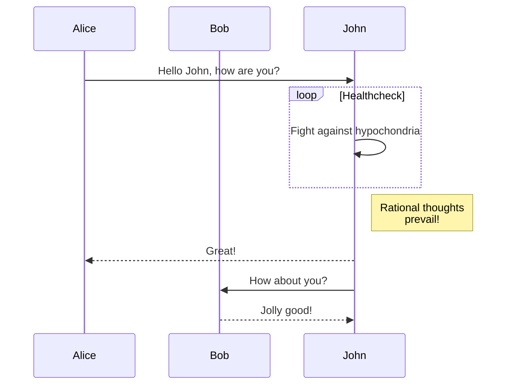

---
# 文章的标题
title: "图标"
# 文章的时间
date: 2023-05-17T16:53:49+08:00
# 文章是否为草稿状态 草稿状态不会发布到文章列表
draft: false
# 文章描述 在文章列表页展示的内容
description: "文章描述"
# 文章的过期时间  过期后不会发布到文章列表
#expiryDate:  //.ExpiryDate
# 文章的发布时间  未到达发布时间不会发布到文章列表
#publishDate: //.PublishDate
# 上次修改的日期
#lastmod: // .Lastmod
# 作者
author: "OverookArt"
---

## GoAT 图表  

Hugo原生支持GoAT  

* 不同的样式效果

```
      .               .                .               .--- 1          .-- 1     / 1
     / \              |                |           .---+            .-+         +
    /   \         .---+---.         .--+--.        |   '--- 2      |   '-- 2   / \ 2
   +     +        |       |        |       |    ---+            ---+          +
  / \   / \     .-+-.   .-+-.     .+.     .+.      |   .--- 3      |   .-- 3   \ / 3
 /   \ /   \    |   |   |   |    |   |   |   |     '---+            '-+         +
 1   2 3   4    1   2   3   4    1   2   3   4         '--- 4          '-- 4     \ 4

```  

```goat
      .               .                .               .--- 1          .-- 1     / 1
     / \              |                |           .---+            .-+         +
    /   \         .---+---.         .--+--.        |   '--- 2      |   '-- 2   / \ 2
   +     +        |       |        |       |    ---+            ---+          +
  / \   / \     .-+-.   .-+-.     .+.     .+.      |   .--- 3      |   .-- 3   \ / 3
 /   \ /   \    |   |   |   |    |   |   |   |     '---+            '-+         +
 1   2 3   4    1   2   3   4    1   2   3   4         '--- 4          '-- 4     \ 4

```  

## Mermaid 图表  

[mermaid js 官方文档](https://mermaid.js.org/syntax/sequenceDiagram.html)

Hugo目前没有提供 Mermaid 的默认模板。


1. 创建一个匹配 md 文件中以 mermaid 标识的代码块内容的布局模版  
文件路径: layouts/_default/_markup/render-codeblock-mermaid.html

``` html
<!-- render-codeblock-mermaid.html -->
<!-- md 文件中的 ```mermaid ``` 的代码块内容将应用该布局文件 -->
<div class="mermaid">
    {{- .Inner | safeHTML }}
</div>
{{ .Page.Store.Set "hasMermaid" true }}

```

2. 在 Content 布局模版底部添加渲染 mermaid 功能，需要借助 mermaid js 来渲染 mermaid 代码块的内容

``` html
<!-- layouts/_default/single.html -->
{{define "main"}}
    <!-- 其他代码 -->
{{ if .Page.Store.Get "hasMermaid" }}
  <script type="module">
    import mermaid from 'https://cdn.jsdelivr.net/npm/mermaid/dist/mermaid.esm.min.mjs';
    mermaid.initialize({ startOnLoad: true });
  </script>
{{ end }}
{{end}}
```


