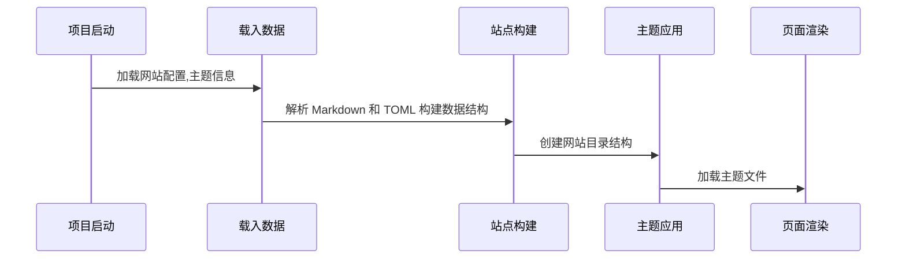

## HUGO 简介  

[HUGO 官网](https://gohugo.io)  

Hugo是一款由Go语言开发的静态网站生成器。它的主要特点是:  

* 速度极快:Hugo能在毫秒级内构建网站,主要因为它基于Go开发可以进行并行编译。
* 易用:Hugo有简单的命令和直观的配置,非常易于上手和使用。
* 跨平台:可以在Windows、Linux、macOS等任意平台安装运行。
* 博客友好:内置支持文章、标签、分类等元素,非常适合构建博客网站。
* 支持主题:有丰富的开源主题可供选择,可以方便切换主题修改网站样式。
* 自定义:Hugo支持自定义模板、样式、布局等,可以完全控制网站输出。
* 部署方便:可以方便部署到任意静态网站托管服务,还支持自动部署。
* 开源免费:Hugo是完全开源的项目,可以免费商业使用。
* 社区活跃:有活跃的用户社区可以提供各种资料和帮助。  

Hugo的这些优点使其成为一个非常流行和强大的静态网站生成器。许多博客和开源项目都选择使用Hugo来构建和管理自己的网站,这也进一步推动了Hugo社区的发展。
总之,Hugo是一个快速、易用、功能强大的静态网站生成工具,适用于构建个人博客、开源项目网站或者商业项目网站。希望这个简介能加深您对Hugo的了解。

## 快速使用  

``` shell
# macOS安装/更新版本
$ brew install hugo

$ brew upgrade hugo

# windows 安装
$

# 查看安装的版本 
$ hugo version

# 生成站点
$ hugo new site 

# 下载主题
$ git submodule add https://github.com/theNewDynamic/gohugo-theme-ananke themes/ananke

# 配置主题
$ echo "theme = 'ananke'" >> config.toml

# 添加页面 
$ hugo new posts/my-first-post.md

# 运行调试
$ hugo serve
$ hugo server -D

# 编译
$ hugo
$ hugo -D #编译正在开发的文章
$ hugo -E #编译已经过期的文章
$ hugo -F #编译即将发布的文章
```  

## Hugo 如何工作的  

1. 网站初始化:加载配置，Hugo会根据配置加载网站配置,主题等信息初始化网站  
2. 载入数据:解析 Markdown 和 TOML,构建数据结构，Hugo会解析并载入网站内容文件夹的Markdown文件、TOML配置等数据源,转换为Hugo的数据结构。  
3. 站点构建:创建网站目录结构，根据配置创建网站目录结构,如content、themes、static、data等文件夹。
4. 主题应用:加载主题至网站，根据主题配置加载主题文件夹,将主题的模板、静态资源等合并到网站中。
5. 页面渲染:渲染模板生成HTML，Hugo根据templates中的模版和数据的渲染生成HTML页面。并将CSS、JS等资源复制到输出的public文件夹。
6. 资源处理:复制CSS, JS等至输出文件夹， 输出public:Hugo将渲染生成的HTML页面以及资源文件输出到public文件夹。public文件夹中的内容就是最终构建的静态网站。  
7. 输出和发布:构建输出文件夹并部署，将public文件夹的内容部署至Web服务器,最终完成网站的发布。




## 部署到 Github  

### 先决条件

1. 创建 Github 账号  
2. 安装 Git 环境
3. 创建 Hugo 项目，并使用 Hugo serve 在本地测试  

### 网站类型  

GitHub Pages网站有三种类型：项目、用户和组织。项目站点连接到GitHub上托管的特定项目。用户和组织网站连接到GitHub.com上的特定帐户。

### 部署流程  

1. 创建一个 GitHub 仓库  
2. 将本地的 Hugo 项目代码提交到 GitHub 仓库
3. 修改 GitHub 仓库的名称为 “”
4. 配置 GitHub Pages  
5. 将 GitHub Pages 的部署方式改为 GitHub Actions  
6. 在 GitHub 仓库 的 workflows 下创建部署脚本文件 /workflows/hugo.yaml  
7. 编写部署脚本
   ``` yaml
   # Sample workflow for building and deploying a Hugo site to GitHub Pages
    name: Deploy Hugo site to Pages

    on:
    # Runs on pushes targeting the default branch
    push:
        branches:
        - main

    # Allows you to run this workflow manually from the Actions tab
    workflow_dispatch:

    # Sets permissions of the GITHUB_TOKEN to allow deployment to GitHub Pages
    permissions:
    contents: read
    pages: write
    id-token: write

    # Allow only one concurrent deployment, skipping runs queued between the run in-progress and latest queued.
    # However, do NOT cancel in-progress runs as we want to allow these production deployments to complete.
    concurrency:
    group: "pages"
    cancel-in-progress: false

    # Default to bash
    defaults:
    run:
        shell: bash

    jobs:
    # Build job
    build:
        runs-on: ubuntu-latest
        env:
        HUGO_VERSION: 0.136.4
        steps:
        - name: Install Hugo CLI
        run: |
          wget -O ${{ runner.temp }}/hugo.deb https://github.com/gohugoio/hugo/releases/download/v${HUGO_VERSION}/hugo_extended_${HUGO_VERSION}_linux-amd64.deb \
          && sudo dpkg -i ${{ runner.temp }}/hugo.deb          
      - name: Install Dart Sass Embedded
        run: sudo snap install dart-sass-embedded
      - name: Checkout
        uses: actions/checkout@v3
        with:
          submodules: recursive
          fetch-depth: 0
      - name: Setup Pages
        id: pages
        uses: actions/configure-pages@v3
      - name: Install Node.js dependencies
        run: "[[ -f package-lock.json || -f npm-shrinkwrap.json ]] && npm ci || true"
      - name: Build with Hugo
        env:
          # For maximum backward compatibility with Hugo modules
          HUGO_ENVIRONMENT: production
          HUGO_ENV: production
        run: |
          hugo \
            --gc \
            --minify \
            --baseURL "${{ steps.pages.outputs.base_url }}/"          
      - name: Upload artifact
        uses: actions/upload-pages-artifact@v1
        with:
          path: ./public

    # Deployment job
    deploy:
    environment:
      name: github-pages
      url: ${{ steps.deployment.outputs.page_url }}
    runs-on: ubuntu-latest
    needs: build
    steps:
      - name: Deploy to GitHub Pages
        id: deployment
        uses: actions/deploy-pages@v2
   ```

8. 使用类似“添加工作流”的提交消息将更改提交到本地存储库，然后推送到GitHub。

content 提供 markdown 文件作为页面内容

layouts 提供页面布局及样式

## Hugo Modules  

1. 安装 go 环境 https://golang.org/dl/  
2. 初始化 $ hugo mod init github.com/gohugoio/myShortcodes
3. 添加一个主题模块 $ hugo mod get github.com/panr/hugo-theme-terminal
4. 配置项目模块
5. 更新所有模块 $ hugo mod get -u 
